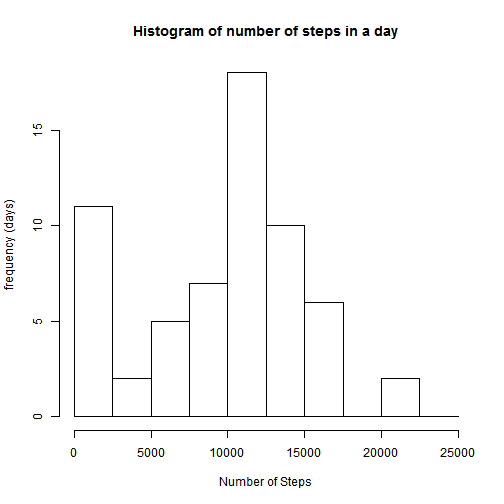

### Load Libraries and Data

```r
library(lubridate)
library(dplyr)
library(tidyr)
library(lattice)
dat <- read.csv('activity.csv')
```

###Convert date and interval columns into more usable formats
convert date column into a date object

```r
dat <- mutate(dat, date = ymd(date))
```

create a minutes column and convert interval column to 'HH:MM' format

```r
dat <- mutate(dat, interval = formatC(interval, width = 4, flag = '0')) #zero pad interval column
dat$interval <- strptime(dat$interval, format = '%H%M') #convert interval to datetime object
dat <- mutate(dat, minutes = hour(interval) * 60 + minute(interval)) #create minutes column
dat <- mutate(dat, interval = format(interval, '%H:%M')) #format interval column
```

### What is mean total number of steps taken per day?
Extract a list giving total steps for each day

```r
step_day <- tapply(dat$steps, dat$date, sum, na.rm = TRUE)
```

Histogram showing distribution of number of steps in a day

```r
hist(step_day, main = 'Histogram of number of steps in a day', xlab = 'Number of Steps', ylab = 'frequency (days)', breaks = c(0,2500,5000,7500,10000,12500,15000,17500,20000,22500,25000))
```

 

Mean and median of total steps per day

```r
mean(step_day)
```

```
## [1] 9354.23
```

```r
median(step_day)
```

```
## [1] 10395
```

### What is the average daily activity pattern?
Extract a list giving mean steps for every 5-minute interval, averaged across all days

```r
step_interval <- tapply(dat$steps, as.factor(dat$minutes), mean, na.rm = TRUE)
step_interval <- format(step_interval, digits = 2)#format values to 2 decimal places
```

Plot average steps by time interval

```r
minutes <- unique(dat$minutes)#variable for x-axis
par(cex.axis = .7, mgp = c(2, .45, 0))
plot(step_interval ~ minutes, type='l', xaxt = 'n', ylab = 'Steps (per 5-minute interval)', xlab = 'Time of Day')
axis(1, at = seq(0, 1440, 180), label = c('12am', '3am', '6am', '9am', '12pm', '3pm', '6pm', '9pm', '12am'))# add x-axis labels
axis(1, at = seq(0, 1440, 60), label = FALSE)# add x-axis tick marks
```

 

Get maximum

```r
max <- max(step_interval)
print(max)
```

```
## [1] "206.170"
```

Find interval associated with the maximum

```r
max_pos <- which(step_interval == max)
intervals <- unique(dat$interval)
intervals[max_pos]
```

```
## [1] "08:35"
```

### Imputing missing values
Find number rows with an 'NA' value

```r
sum(is.na(dat$steps))
```

```
## [1] 2304
```

Replace missing values with mean of that interval across all days

```r
impute_vector <- vector() #vector to store steps, with imputed values replacing NA
i <- 0
for (i in 1:length(dat$steps)){
  if (is.na(dat$steps[i])){
    impute_vector[i] <- step_interval[as.character(dat$minutes[i])] #replace NA with interval mean matching the current row's interval value
  }
  else{
    impute_vector[i] <- dat$steps[i] #
  }
}
```

Create new data frame that includes imputed values

```r
new_dat <- dat %>% #create a new data frame copying dat
  mutate(impute_steps = impute_vector) %>% #add the impute vector as a column
  mutate(impute_steps = as.numeric(format(impute_steps, digits = 2))) %>% 
  select(-steps) #remove original 'steps' column that contains NA's
```

Histogram showing distribution of number of steps in a day (imputed values)

```r
impute_step_day <- tapply(new_dat$impute_steps, new_dat$date, sum) #list collapsing steps across day
hist(impute_step_day, main = 'Histogram of number of steps in a day', xlab = 'Number of Steps', ylab = 'frequency (days)', breaks = c(0,2500,5000,7500,10000,12500,15000,17500,20000,22500,25000))
```

 

Mean and Median of Total Steps per Day

```r
mean(impute_step_day)
```

```
## [1] 10766.19
```

```r
median(impute_step_day)
```

```
## [1] 10766.19
```

*Mean and Median increased slightly, and histogram shows much fewer days with zero steps.  Days with NA values were replaced with
imputed values which resulted in fewer zero days and raised the mean and median.  Zero days were
move toward the mean, making the shape closer to a normal distribution*

### Are there differences in activity patterns between weekdays and weekends?
Add 'Weekday' column to the data frame as factor variable

```r
weekday_vect <- weekdays(new_dat$date) #Create vector of the weekday associated with each date
# Convert vector from day into Weekend/Weekday
weekday_vect <- sapply(weekday_vect, function(entry){
  if (entry %in% c('Saturday','Sunday')){
    entry <- 'Weekend'
  }
  else{
    entry <- 'Weekday'
  }
})
new_dat <- mutate(new_dat, weekday = as.factor(weekday_vect)) # add Weekend/Weekday vector to data frame
```

Create a data frame with steps means collapsed across minutes and a Weekend/Weekday variable

```r
# create data frame of steps mean, collapsed across minutes(interval) and Weekend/Weekday
step_interval_day <- as.data.frame(tapply(new_dat$impute_steps, list(as.factor(new_dat$minutes),new_dat$weekday), mean))
# minutes are row names.  convert to vector and add to data frame as a column
names <- row.names(step_interval_day)
step_interval_day <- mutate(step_interval_day, minutes = as.numeric(names))
#reshape data so that Weekday/Weekend is a single column day_type
step_interval_day <- gather(step_interval_day, day_type, steps, Weekday:Weekend)
```

Plot steps mean for each minute interval paneled by Weekend/Weekday

```r
time_labels <- c('12am', '3am', '6am', '9am', '12pm', '3pm', '6pm', '9pm', '12am')
label_vector <- rep('', 25)
j <- 0
for (j in 1:length(time_labels)){
  label_vector[3*j -2] <- time_labels[j]
}
xyplot(steps ~ minutes | day_type,data = step_interval_day, layout = c(1,2), type = 'l', ylab = 'Steps (per 5-minute interval)', xlab = 'Time of Day', scales = list(x = list(at = seq(0,1440,60), labels = label_vector)))
```

 
